<h3><code>divyal-11@github ~ $ ./contributions.sh</code></h3>

  

<h3><code>divyal-11@github ~ $ whoami</code></h3>

 

## 🌐 Socials:
 

# 💻 Tech Stack:
      

# 📊 GitHub Stats:
 
 

## 🏆 GitHub Trophies

---

<!-- Terminal-style header generated with a custom SVG pipeline; rest proudly created with GPRM ( https://gprm.itsvg.in ) -->
